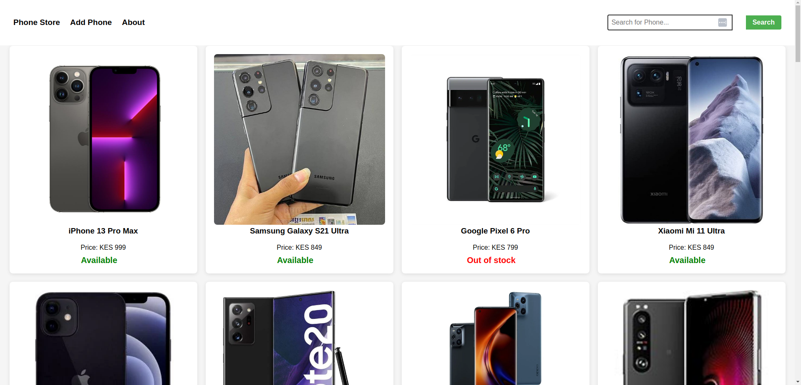

# React Phone Store App

#### This is a simple and user-friendly phone store app built with React JS. It showcases a collection of smartphones, allowing users to search, filter, and view detailed information about each device. 

#### By **Dennis Kemboi**

## Description

This is a phone store application built with React JS. The app showcases core React concepts, including components, state management, and React Router for navigation. Users can browse a list of available phones on the homepage, view detailed information on individual phones, access the About page, and submit new phones via the Add Phone form."


## Screenshot




## Features

- Home page displaying a list of phones
- Individual phone page
- About page
- Search feature
- Simple and clean UI design
- A form to upload phone with its details
- Contact seller on whatsapp

## How to Use

### Requirements

- A computer, tablet, or phone
- Access to the internet
- A modern web browser

### View Live Site

Visit the deployed application at: [React Phone Store](https://blog-app-sdf-ft11.netlify.app/)

The live site allows you to:

- Browse through the list of phones on the home page
- Click on any phone to see features and contact seller
- Navigate to the About page to learn more about the website
- Click on whatsapp link to contact seller
- you can add new for using add phone page

### Local Development

If you want to run the project locally, you'll need:

- Node.js installed on your computer
- Basic understanding of React JS
- Code editor (VS Code recommended)
- Terminal/Command Line

#### Installation Process

1. Clone this repository using:

   ```bash
   git clone git@github.com:Denkogei/phone-store.git
   ```

   or by downloading a ZIP file of the code.

2. Navigate to the project directory:

   ```bash
   cd phone-store
   ```

3. Install the required dependencies:

   ```bash
   npm install
   ```

4. Run json server:

   ```bash
   json-server --watch db.json
   ```
 
5. Run the development server:

   ```bash
   npm start
   ```

5. Open your browser and visit `http://localhost:3001`

## Technologies Used

- React JS
- create-react-app
- CSS3
- JavaScript (ES6)
- Font-awesome

## Related Repositories

### Backend API

- Repository: [Phone Store API Repository](https://github.com/dennis-kiboi/blog-app-sdf-ft11-json-server)
- Deployed API: [Live API URL](https://blog-app-sdf-ft11-json-server.onrender.com)

## Support and Contact Details

If you have any questions, suggestions, or need assistance, please contact:

- Email: <denkogei11@gmail.com>

## License

MIT License

Copyright &copy; 2024 Dennis Kemboi

Permission is hereby granted, free of charge, to any person obtaining a copy of this software and associated documentation files (the "Software"), to deal in the Software without restriction, including without limitation the rights to use, copy, modify, merge, publish, distribute, sublicense, and/or sell copies of the Software, and to permit persons to whom the Software is furnished to do so, subject to the following conditions:

The above copyright notice and this permission notice shall be included in all copies or substantial portions of the Software.

THE SOFTWARE IS PROVIDED "AS IS", WITHOUT WARRANTY OF ANY KIND, EXPRESS OR IMPLIED, INCLUDING BUT NOT LIMITED TO THE WARRANTIES OF MERCHANTABILITY, FITNESS FOR A PARTICULAR PURPOSE AND NONINFRINGEMENT. IN NO EVENT SHALL THE AUTHORS OR COPYRIGHT HOLDERS BE LIABLE FOR ANY CLAIM, DAMAGES OR OTHER LIABILITY, WHETHER IN AN ACTION OF CONTRACT, TORT OR OTHERWISE, ARISING FROM, OUT OF OR IN CONNECTION WITH THE SOFTWARE OR THE USE OR OTHER DEALINGS IN THE SOFTWARE.